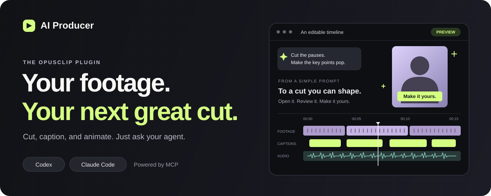
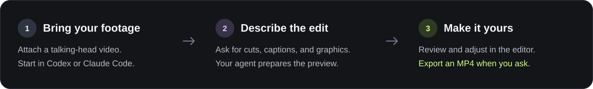

<p align="center">
  <a href="https://producer.opus.pro">
    
  </a>
</p>

<h1 align="center">AI Producer Plugin</h1>

<p align="center">Turn talking-head footage into an editable video, right from your coding agent.<br>Cut the pauses, add captions, and bring key moments to life with motion graphics.</p>

<p align="center">
  <a href="https://producer.opus.pro/docs/plugins"><strong>Install the plugin</strong></a> &nbsp; | &nbsp;
  <a href="https://producer.opus.pro/docs">Documentation</a> &nbsp; | &nbsp;
  <a href="https://producer.opus.pro">Open AI Producer</a>
</p>

<p align="center">
  <a href="https://github.com/opus-pro/ai-producer-plugin/actions/workflows/validate.yml"></a>
  <a href="https://producer.opus.pro/docs/plugins"></a>
  <a href="https://producer.opus.pro/docs/plugins"></a>
  <a href="THIRD_PARTY_NOTICES.md"></a>
</p>

## From footage to an editable preview



| Give your video... | What you can ask for |
| --- | --- |
| **A tighter cut** | Remove dead air and tighten the pacing of a talking-head video. |
| **Captions that follow along** | Add captions and highlight key phrases. |
| **A visual point of view** | Add motion graphics, callouts, and supporting visuals. |
| **The finishing touches** | Add music and sound effects, then request an MP4 export when ready. |

You get an **editable preview link by default**, so you can review the result and make changes in AI Producer. Export happens only when you request it. Playback review and follow-up creative decisions stay with you; the plugin does not automatically inspect or revise the generated video.

## Get started

1. **[Install in Codex or Claude Code](https://producer.opus.pro/docs/plugins).** Follow the official guide for your client, sign in with your OpusClip account, and verify the connection.
2. **Attach your video** in a new task or session with the plugin loaded.
3. **Tell AI Producer what you want.** Start with one of the prompts below, or describe your own edit.

The plugin bundles the editing skills and MCP connection. Video processing runs on the hosted AI Producer service; **service access and credits are separate from installing the plugin**. See the [getting started guide](https://producer.opus.pro/docs/getting-started) for the product workflow and credit details.

### Try a prompt

**Start with a clean cut**

```text
Use AI Producer to edit my attached talking-head video.
Cut the dead air, add captions, and give me the editable preview link.
```

**Give it more personality**

```text
Use AI Producer to add motion graphics that emphasize the key points
in my video. Add background music and give me an editable preview.
```

**Export when ready**

```text
Export this AI Producer project as an MP4.
```

## What's included

| Component | Purpose |
| --- | --- |
| [AI Producer skill](plugins/aip/skills/aip/SKILL.md) | Video editing capabilities and the handoff to an editable preview. |
| [Composition skill](plugins/aip/skills/aip-composition/SKILL.md) | The composition, timing, and editor contract, derived from HyperFrames. |
| [Workspace reference](plugins/aip/skills/aip/references/workspace.md) | The workspace files accepted by the service. |
| [MCP connection](plugins/aip/.mcp.json) | The connection to the hosted AI Producer service. |

The plugin ships skills and MCP configuration, with no lifecycle hooks or self-update commands. Installation and updates are managed by your client. The bundled static-check and upload helpers use Python 3.10 or newer; hosts without it can use their own static-check and batch HTTP tools.

## Development

Requires Python 3.10 or newer for the offline checks.

```bash
python3 scripts/test.py
```

In a Codex or Claude Code task opened in this repository, say "set up the local plugin" or invoke `/aip-plugin-local` to use the [local development workflow](.agents/skills/aip-plugin-local/SKILL.md). It builds **AI Producer Local**, refreshes host installation, and guides controlled quality, duration, and client-cost comparisons. Local instructions use the selected source's MCP service; a local plugin does not start a local backend.

See [CONTRIBUTING.md](CONTRIBUTING.md) for development and [SECURITY.md](SECURITY.md) for vulnerability reporting. For bugs and proposals, [open an issue](https://github.com/opus-pro/ai-producer-plugin/issues).

## License and attribution

Original plugin source is licensed under [MIT](LICENSE). The HyperFrames-derived composition skill is licensed under [Apache-2.0](plugins/aip/licenses/Apache-2.0.txt). See the [third-party notices](THIRD_PARTY_NOTICES.md) for source attribution and branding boundaries.

<p align="center">Built by <a href="https://www.opus.pro/">OpusClip</a>.</p>
